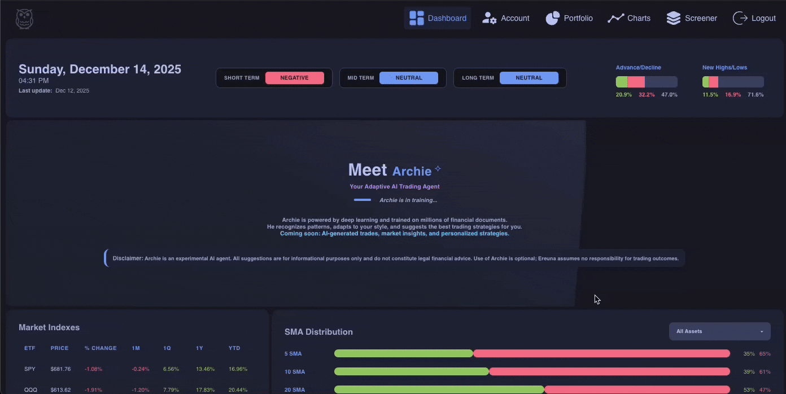

<div align="center">

### Portfolio Project — Proof of Work

**This repository is open-sourced as a portfolio demonstration only.**  
⚠️ **Non-commercial use only** — See [LICENSE.md](LICENSE.md) for terms.

</div>



---

## Current status — read this first

**This repository is mid-rewrite and is not production-ready. Don't deploy it.**

Ereuna was my first project — I learned to code by building it. It ran in production
for a startup that didn't work out, and at its peak it was a real system: 60k+
instruments, ~450M documents, 10–20M websocket messages a day, 14 containers on a
single VPS behind Traefik.

It was also badly engineered, in the specific way a first project is badly engineered:
logic in the wrong layer, no consistent error contract, business rules computed in the
browser, a Python service doing a job that had no reason to be a separate language.
It worked, and I could no longer defend how it worked.

So I'm rewriting it, domain by domain, against a written standard I wrote first. That
rewrite is what you're looking at. As of **2026-09-13**, batches 1–8b are done —
foundation, auth and app shell, charts, screener, portfolio, frontend restructuring,
and the realtime services rebuilt in Node — and the charting layer, which was the last
thing in the tree living outside the rules, has been restructured, gated and tested
along with everything else.

### What that means for anyone reading the code

- **The app does not currently work end to end.** I know of open bugs and I'm working
  through them in order. Fixes land as batches, not as one big-bang restoration.
- **The live market-data path is unverified.** The ingestor holds one socket to the
  vendor's trade feed and the worker buckets that stream into candles. Neither can be
  meaningfully tested for time constraints, so both are written but not yet proven
  against real traffic as the previous implementation.
- **There is no infrastructure in this repo.** No Dockerfiles, no compose, no Traefik,
  no Prometheus/Grafana/Loki. That was all deliberately dropped from scope. Infra isn't
  where my strength is, rebuilding it correctly would cost more time than the rewrite
  itself, and a portfolio repo doesn't need to be deployable to be readable. The
  production stack described in older versions of this file was real — it just isn't
  what this repository is anymore.
- **Test coverage is high, and you should discount it accordingly.** See the note below.
- **Nothing here is production-ready until I've read it myself.** That review is months
  of work and it hasn't happened yet. See the note below for why I'm not rushing it.

The banner and demo GIF above are from the pre-rewrite version, and show features that
have since been cut or are being rebuilt.

## How this was built

This rewrite is AI-assisted, and I'd rather say so than let you guess from the commit
velocity.

I did not hand-type 65,000 lines in a week, and nobody should claim they did. What I
wrote is the layer above the code:

- **The standard.** A written spec covering git, TypeScript, Vue, SCSS, HTML, i18n, API
  design, database, env, websockets, error handling, testing and refactoring — authored
  before the rewrite started, and held against a reference implementation so that
  "how should this look" always has an answer.
- **The architecture and its rationale.** Every non-obvious decision in this codebase is
  recorded with the reason it was made. Why the gateway has deliberately _no_ Redis
  adapter. Why the candle index is ascending when every read is newest-first. Why the
  ingestor and the aggregate role are singletons and cannot be `worker_threads` inside
  the API. Why migrations are forward-only and never touch indexes. Those are judgment
  calls, and they're mine.
- **The bar it has to clear.** Nothing lands here because it looks right. Eighteen custom
  gates in [`scripts/checks/`](scripts/checks/) run as `npm run ci:check` alongside ESLint,
  Prettier, stylelint, typecheck and the test suites, and each gate is there for a specific
  failure that's invisible in a diff — a locale missing a key renders its own dotted path;
  a theme missing a token is an invisible element in that theme only. What I own is the
  decision that all of them are green before a batch is called done, and the calls about
  which ones are inverted here on purpose — the gateway gate that _fails_ if a Redis
  adapter appears, the security gate that allows exactly two unauthenticated mounts.

That's the difference I'd point at. Vibe coding is accepting output with no spec and no
verification. Here the spec and the verification came first, and the generated code has
to survive them.

**On the test numbers:** unit coverage sits at 92% of lines and 83% of branches across
272 test files, plus 11 Playwright end-to-end specs. Treat that as evidence the suite
exists and passes, not as evidence the code is correct — tests generated alongside the
code, from the same spec, can encode the same misunderstanding the code does. The gates
catch structural drift. They don't catch a wrong idea, faithfully implemented and
faithfully tested.

So the review is the work that's left. Over the coming months I'll read this codebase
line by line — not skim it, read it — and when I've done that and I'm satisfied with
what I find, I'll give the go-ahead for production myself. I'm not doing it now. It's
months of careful work, I don't have the time for it this side of the rewrite, and I've
watched enough people burn themselves out sprinting at the end of a project to know that
forcing it would produce a worse review than doing it slowly. Until that review is
finished, the honest answer is that this repository is unproven, and I'd rather state it
than have you find it.

---

## What it does

A market research app: screener, charts, portfolio simulation, market data.

- **Dashboard** — market outlook overview
- **Screener** — 40+ filters, mini charts, customizable tables, multi-screener with
  overlap detection, per-user hidden list
- **Charts** — a forked and extended build of TradingView's Lightweight Charts (v4, when i started the original project),
  watchlists, fundamentals panels
- **Portfolio simulation** — up to 10 portfolios, benchmarks, cash deposits and
  withdrawals, long and short positions, fractional shares, leverage to 10x, full CRUD
  on every trade
- **Account** — CRUD, recovery codes, 2FA, 6 themes (3 dark, 3 light), 18 languages

The portfolio is **event-sourced**: the trade log is the only thing stored, and cash,
positions, value history and every statistic are replayed server-side after each write.
Nothing is incremented in place, which is what makes editing or deleting a trade safe.
No portfolio number is ever computed in the browser.

## Tech stack

**TypeScript end to end.** There is no Python in this repository — the two services that
used to be FastAPI are now Node workspaces.

- **Frontend** — Vue 3.5 (`<script setup>`), TypeScript, Vite, vue-i18n, SCSS. No Pinia;
  state lives in composables grouped by domain.
- **API** — Node.js, Express, Zod, MongoDB, Socket.IO
- **Worker** — Node.js; realtime candle aggregation and the nightly batch, split by role
- **Ingestor** — Node.js; a single socket to the vendor's trade feed
- **Shared** — `@ereuna/shared`, consumed as TypeScript source by every workspace
- **Data** — MongoDB (time series collections for candles), Redis (streams + pub/sub)
- **Market data** — Tiingo

Requires **Node >= 24**.

## Why I built it

To speed up my weekly screening routine.

My strategy is running several screeners with few filters each and looking for overlaps —
the more a symbol repeats, the stronger the signal. Running them one at a time and
comparing lists by hand was slow, error-prone, and full of results I didn't care about.

**Before:**

```
Screener 1 → Results A (200 stocks)
Screener 2 → Results B (180 stocks)  } Manual comparison
Screener 3 → Results C (150 stocks)  } Look for overlaps
Screener 4 → Results D (220 stocks)  } Human error prone
              ↓
      Final list (maybe 30-40 stocks)
      Time: hours
```

**After:**

```
Screener 1 + 2 + 3 + 4 → [Multi-Screener Engine]
                              ↓
                    Automatic overlap detection
                    Sort by duplicate count
                    Apply hidden list filter
                              ↓
                    Final list (30-40 stocks)
                    Strongest signals first
                    Time: minutes
```

Each user can hide assets they never want to see — meme coins, zombie penny stocks —
and they stop appearing in query results. They're still reachable in the Charts section,
which reminds you they're hidden.

## Running it locally

You need MongoDB and Redis running, and a Tiingo API key if you want the market-data
services to do anything.

```bash
npm install

# frontend (:3500) + api (:5500) together
npm run dev
```

The other processes run on their own, because none of them can be folded into another:

```bash
npm run ingestor          # vendor trade feed → Redis stream
npm run worker            # both roles (default for local work)
npm run worker:aggregate  # realtime bucketing only
npm run worker:organize   # nightly batch only
```

Database:

```bash
npm run db:migrate         # forward-only migrations
npm run db:migrate:status
```

### Environment

Most infra values have working local defaults, so a fresh clone starts with very little.
Two secrets have no default and will kill the process at boot if missing:

```bash
JWT_SECRET=            # 32+ characters
TOTP_ENCRYPTION_KEY=   # 64 hex characters (AES-256-GCM key for TOTP secrets at rest)
TIINGO_KEY=            # required by the ingestor and the worker
```

Optional overrides: `MONGO_URI`, `MONGO_DB`, `REDIS_HOST`, `REDIS_PORT`, `PORT`,
`CORS_ORIGIN`, `LOG_LEVEL`, `WORKER_ROLE`. In production the schema rejects any value
that's still a recognisable dev placeholder, rather than quietly booting with it.

## Architecture

```
Ereuna/                              # npm workspaces monorepo
├── packages/shared/                 # @ereuna/shared — cross-workspace contracts
│   └── src/
│       ├── config/env.ts            # shared Zod env fragments
│       ├── db/indexes.ts            # the ONE place a collection or index is declared
│       └── market/realtime.ts       # every Redis key and channel name
│
├── frontend/                        # Vue 3 SPA
│   └── src/
│       ├── api/                     # typed HTTP clients
│       ├── components/              # auth, charts, dashboard, portfolio,
│       │                            #   screener, ui, user, viz
│       ├── composables/             # domain state (no Pinia)
│       ├── constants/               # enums, icon path registry
│       ├── lib/charting/            # the charting layer: engine/ (forked
│       │                            #   renderer), drawings/, patterns/, shared/
│       ├── locales/                 # 18 locales, every key in every file
│       ├── router/  styles/  types/  utils/  views/
│
├── api/                             # Express REST + Socket.IO
│   └── src/
│       ├── routes/                  # validate and delegate
│       ├── services/                # business logic
│       ├── gateway/                 # Socket.IO, on the API's own HTTP server
│       ├── lib/                     # one external concern each
│       ├── middleware/              # auth, error handler
│       └── utils/                   # pure
│
├── worker/                          # realtime aggregation + nightly batch
│   └── src/
│       ├── aggregate/               # XREADGROUP → 7 timeframes → MongoDB
│       ├── organize/                # the 19:00 ET dependency line
│       ├── lib/tiingo.ts            # the only module that talks to the vendor
│       └── utils/                   # pure indicator maths
│
├── ingestor/                        # ONE socket to the vendor trade feed
├── db/                              # forward-only migrations + schema docs
├── e2e/                             # Playwright specs
├── eslint/                          # 15 composed rule packs
└── scripts/checks/                  # the 18 custom gates
```

### The realtime path

Three processes, joined only by Redis. Each is a separate workspace because none of them
can be collapsed into another.

```
ingestor → holds ONE socket to the vendor's trade feed, XADDs `tiingo:stream`
   │
   ▼
worker   → aggregate: XREADGROUP over that stream, buckets into 7 timeframes,
   │                  upserts MongoDB, publishes `aggr:{tf}`
   │       organize:  the nightly batch, 19:00 ET
   ▼
api      → one `psubscribe aggr:*` per process, fans out to Socket.IO rooms
```

The ingestor and the aggregate role are **singletons**. Two ingestors double-subscribe
upstream and write every trade twice; two aggregators split the consumer group and each
build half a candle out of half the trades. That's what `WORKER_ROLE` buys — one image,
one entry point, and the ability to pin `replicas: 1` on the aggregate deployment while
the organize one scales freely.

Websockets are Socket.IO on the API's own HTTP server, one port, authenticated with the
access token on the handshake. There is deliberately **no Redis adapter**: the adapter
exists to route an emit raised on one pod to a socket on another, and here every pod
already holds every bucket its own sockets need.

The nightly run is a straight dependency line, not a scheduler: prices → splits →
dividends → weekly → delist → fundamentals → metrics → valuations → market stats →
holidays → prune. Each step is isolated, so one vendor outage costs one step and not
the run.

### Database notes

`packages/shared/src/db/indexes.ts` is the single place a collection name or an index is
declared. The API applies its manifest at boot; the worker applies the candle and
reference manifests.

The seven candle collections are MongoDB **time series** collections, keyed on
`(tickerID, timestamp)` ascending — `tickerID` is an equality match, so the server walks
the ascending index backwards for a newest-first sort at the same cost, and a descending
copy would have cost hours of index build for nothing.

Migrations are **forward-only** and never touch indexes. There's no `down()` — a
reversal that loses data is a second, unreviewed migration that runs during an incident.
Adding an index is a manifest entry applied at the next boot; _dropping_ one is a
migration, because a drop applied at boot would rebuild the index on every restart of
every replica.

## Quality gates

```bash
npm run ci:check    # everything below, in order
```

Eighteen custom gates in [`scripts/checks/`](scripts/checks/) — sixteen take no
dependencies at all and read the tree with `node:fs` and the TypeScript compiler that
was already here; the last two wrap `knip` and `jscpd`. Alongside them: ESLint (15
composed rule packs), `prettier --check`, stylelint, typecheck, the unit suite with
coverage, and Playwright.

Two gates are inverted from the written standard on purpose and say so in their own
headers: `check-ws-standards.ts` _fails_ if a Redis adapter appears on the gateway, and
`check-security-drift.ts` allows exactly two unauthenticated mounts and fails on a third.

Nothing is excluded from them. The charting layer used to be — 208 files of vendored
upstream code, skipped by every gate, with typecheck errors written off as out of scope.
It isn't vendored any more: it's 211 first-party files under
[`frontend/src/lib/charting/`](frontend/src/lib/charting/), it typechecks clean, it lints
under the full rule set, every custom gate reaches it, and it's in coverage scope with
the rest of the repo. The eleven files in it that couldn't get under the 400-line cap are
recorded in a baseline with the reason each one stayed long, and that baseline is a
ratchet — a file may shrink but never grow.

## Dependencies

Runtime dependencies only, per workspace — everything else in the tree is build or test
tooling, listed at the end.

**Shared** (`@ereuna/shared`) — Zod, Pino, prom-client. Every other workspace depends on
it and it is consumed as TypeScript source, so its three are effectively the floor
everywhere: the logger, the env schema fragments, and the `/livez` + `/metrics` probe
listener the headless processes run.

**Frontend** — Vue 3, Vue Router, Vue I18n, axios, socket.io-client, QRCode.vue,
fancy-canvas. Vite, TypeScript and SCSS are build tooling, not runtime dependencies.
The charting layer is **not** a dependency: the fork of Lightweight Charts lives in the
tree as first-party code under `lib/charting/`, held to the same gates as everything
else — `fancy-canvas`, upstream's canvas-sizing package, is the one thing it still
imports from outside. Charts outside it are hand-written SVG in `components/viz/`,
scaled by `viewBox`.

**API** — Express, Zod, MongoDB driver, Socket.IO, IORedis, Argon2, jsonwebtoken,
otpauth (TOTP), Helmet, cors, cookie-parser, Pino, dotenv. Rate limiting is not a
library: `lib/rate-limiters.ts` is a Redis-backed token bucket, so the tiers hold across
replicas rather than per process.

**Worker / Ingestor** — MongoDB driver, IORedis, Zod, prom-client, dotenv. Logging is
the shared Pino instance, not a direct dependency of either. The ingestor's vendor socket
uses Node's native `WebSocket`, so there's no client library.

**DB** — migrate-mongo, the CLI that runs the forward-only migrations, and the MongoDB
driver.

**Tooling** — Vite, vue-tsc, TypeScript, sass-embedded, tsx, tsc-alias, Vitest, MSW,
Playwright, ESLint, Prettier, stylelint, knip, jscpd, concurrently.

**External** — Tiingo (market data).

## Acknowledgments

- **TradingView** — for Lightweight Charts, forked and extended here
- **Tiingo** — for the market data APIs
- The Vue, Node and MongoDB communities, and the maintainers of everything above

## Contact

- **Email:** [hello@larrydarko.dev](mailto:hello@larrydarko.dev)
- **GitHub:** [@larrydarko1](https://github.com/larrydarko1)

## License

⚠️ **CC BY-NC-SA 4.0 — non-commercial use only.**

You may **NOT** use this code for commercial products or services, SaaS platforms,
revenue-generating applications, or reselling / repackaging / sublicensing.

You **MAY** use it for learning, portfolio review and technical interviews, personal
non-commercial projects.

See [LICENSE.md](LICENSE.md) for complete terms. For commercial licensing, email hello@larrydarko.dev.
